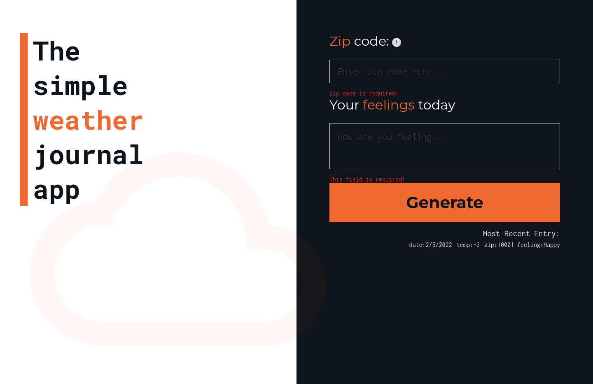
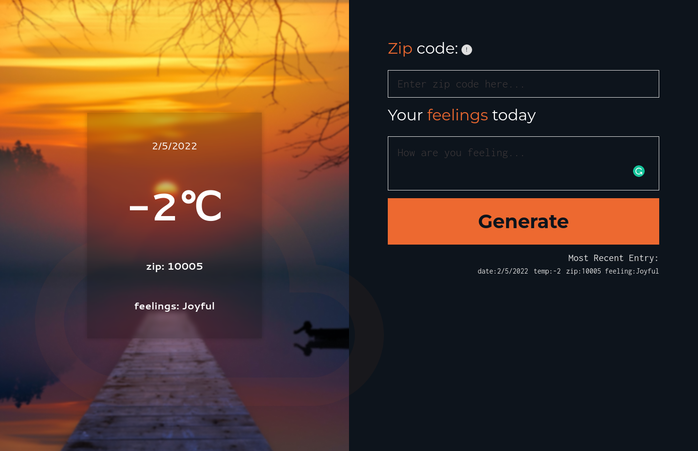
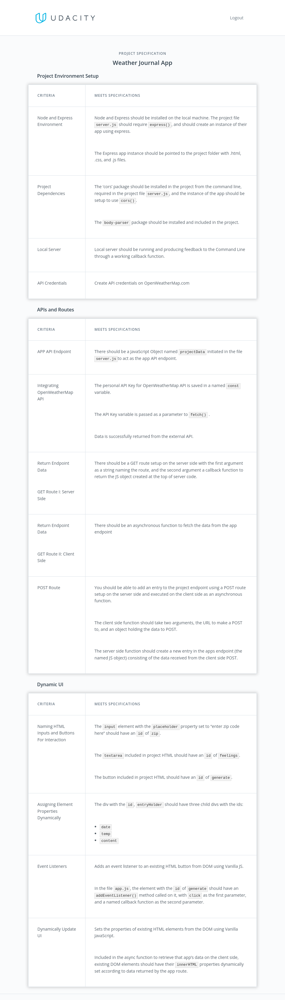
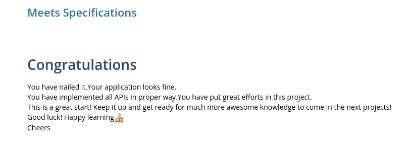

# Screenshots





# Weather Journal App with Asynchronous JavaScript

The third submitted project for the **Web API's and Asynchronous Applications**
chapter of the Udacity's Front End Developer nanodegree.

This project required me to create an asynchronous web app that uses Web API
and user data to dynamically update the UI in a Weather Journal application.

## Rubric

This project has been evaluated by a Udacity code reviewer according to the Weather Journal App project specifications below.

<details>
<summary>Project specification:</summary>

</details>

## Installation

##### [NodeJs](https://nodejs.org/en/) must be installed on your local machine.

1. Open a terminal instance inside the project directory and run `npm install`.
2. run `npm start` in the terminal.
3. Open a navigator and visit `localhost:3000`.

- Inside the project directory, navigate to `/public/app.js` and replace the value of the variable `KEY` with your API key. (you can get your key [here](https://home.openweathermap.org/)).

## Dependencies

The project requires the following packages to run:

- Express v4.x
- Cors
- Mocha
- Chai

## Testing

The project uses a unit testing method.
Both the [Mocha](https://mochajs.org/) framework and the [Chai](https://www.chaijs.com/) library are required to run the test localed at `./test/`
Inside the project directory, open a terminal instance and run:

```
npm test
```

## References used:

- [app.address is not a function](https://stackoverflow.com/questions/33986863/mocha-api-testing-getting-typeerror-app-address-is-not-a-function)
- [MDN](https://developer.mozilla.org)
- [JSDoc](https://jsdoc.app/)
- [Openweathermap's documentation](https://openweathermap.org/current#data)
- [css-tricks.com](https://css-tricks.com/almanac/properties/b/backdrop-filter/)
- [tests](https://www.chaijs.com/guide/styles/)

- [x] Project reviewed and passed successfully.
      
